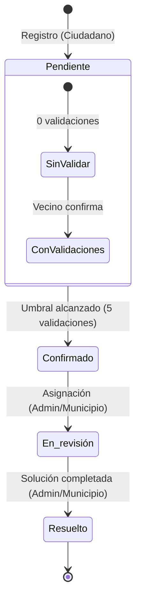

# Ciclo de Vida y Dinámica de Estados de Incidentes en QHALI

Este documento describe las reglas de negocio, transiciones de estados y la codificación de colores visuales en el mapa de reportes de incidencias ciudadanas de **QHALI**.

---

## 1. Mapa de Estados y Colores

Cada reporte de incidencia pasa por distintas fases representadas por colores específicos en el mapa interactivo:

| Estado | Color | Código Hex | Significado / Descripción |
| :--- | :---: | :---: | :--- |
| **Pendiente** | Gris | `#9CA3AF` | El reporte acaba de ser creado por un ciudadano y está en espera de validación de la comunidad. |
| **Confirmado** | Rojo | `#EF4444` | La comunidad ha validado el reporte al alcanzar el umbral de validaciones cruzadas. |
| **En revisión** | Azul | `#3B82F6` | Personal municipal o administradores están evaluando la incidencia para programar su atención. |
| **Resuelto** | Verde | `#22C55E` | La incidencia ha sido atendida y solucionada físicamente en la calle. |

---

## 2. Flujo de Transición y Criterios

### A. Creación del Reporte (Estado: `Pendiente`)
* **Quién:** Cualquier ciudadano autenticado en la PWA.
* **Estado inicial:** Siempre inicia en **Pendiente**.
* **Validaciones iniciales:** `validation_count = 0`.

### B. Validación Ciudadana Cruzada (Transición a `Confirmado`)
* **Mapeo:** Los vecinos dentro de un **radio de 300 metros** de la incidencia pueden verla en su pestaña de **Alertas (Cercanos)**.
* **Validación:** Al hacer clic en "Confirmar incidente", se suma `+1` al contador de validaciones (`validation_count`).
* **Restricción:** Un usuario no puede validar su propio reporte ni validar el mismo reporte más de una vez.
* **Umbral de Cambio:** Cuando el reporte acumula **5 validaciones**, el backend cambia su estado automáticamente a **Confirmado**.

### C. Gestión Municipal (Transiciones a `En revisión` y `Resuelto`)
* **Gestión de Administrador:** A través de la API/Dashboard de administración, el personal autorizado actualiza el estado según el avance físico:
  * **En revisión:** Se asigna cuadrilla o se planifica la reparación.
  * **Resuelto:** El bache ha sido tapado, la luminaria reparada, etc.

---

## 3. Reglas de Visibilidad en el Mapa Público

Para garantizar que el mapa ciudadano se mantenga limpio y libre de spam o coordenadas erróneas, se aplican filtros de visibilidad automáticos:

1. **Visibilidad Absoluta:**
   * Todos los incidentes con estado **Confirmado**, **En revisión** o **Resuelto** son visibles siempre para todos los usuarios en el mapa.
2. **Visibilidad Condicionada (Incidentes Pendientes):**
   * Un reporte **Pendiente** solo se mostrará en el mapa público si cumple **al menos uno** de estos criterios:
     * Fue creado hace **menos de 24 horas** (`created_at >= 24h`).
     * Ya cuenta con **al menos 1 validación** de otro vecino (`validation_count > 0`).
   * Los reportes antiguos sin ninguna validación se ocultan del mapa público, pero permanecen visibles en la sección de **Alertas** para que los vecinos cercanos puedan ir a verificarlos.
